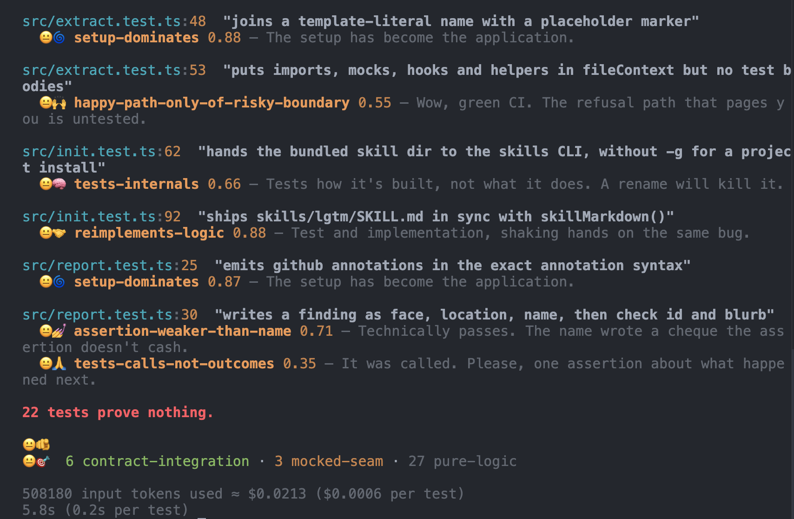
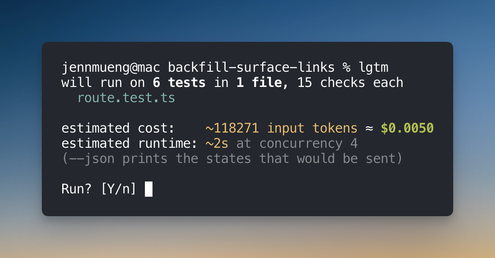
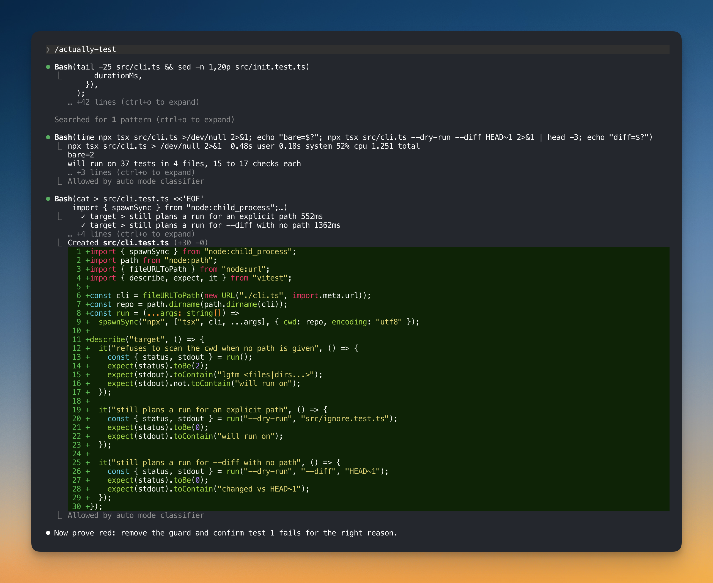
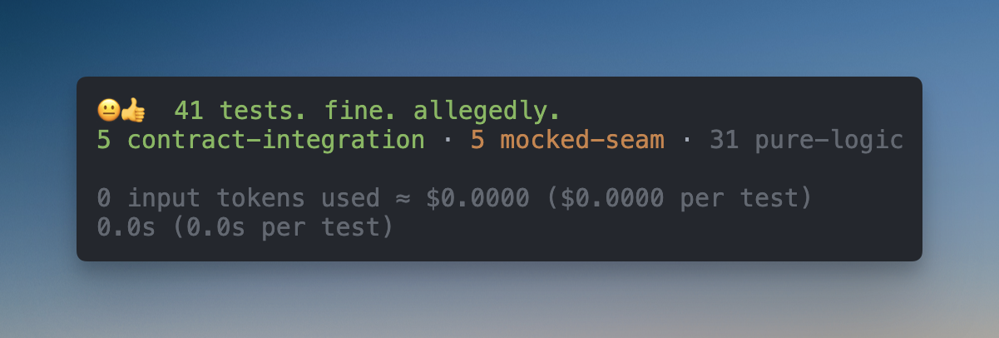

# 😐👍...lgtm?

[](https://www.npmjs.com/package/@stardeckai/lgtm)
[](https://github.com/stardeckai/lgtm/actions/workflows/ci.yml)
[](LICENSE)

Prove that your tests actually test something. Powered by Jev and your own TypeSafe API key.



Your agent wrote 40 tests. They're all green. What do they prove? lgtm reads every test block with its
implementation and tells you which ones are useless.

It runs on [Jev by TypeSafe](https://typesafe.ai), with your own `TYPESAFE_API_KEY`.

With this, you can prove that your agent actually wrote code that actually works, so you can say it lgtm 😐👍.

_Evaluated on real code: 16,000+ test blocks scored across real codebases, 347 read against their implementation and
labelled, thresholds fitted so a finding on real code is worth your time. The held-out numbers are in [Evals](#evals)._

## What you get

- the `lgtm` CLI: run it on a file, a directory or `--diff`, in your terminal or in CI
- a `/lgtm` skill for your coding agents, so the agent that wrote the tests runs the audit and fixes what it finds
- an `/actually-test` skill: write the tests the change needs, prove them red, then iterate with lgtm until they pass

## Install

```sh
bun add -g @stardeckai/lgtm
pnpm add -g @stardeckai/lgtm
npm i -g @stardeckai/lgtm
```

```sh
# or per project
pnpm add -D @stardeckai/lgtm   # then: pnpm lgtm ...   (npm: npx lgtm ...)
```

If `lgtm` is not found after a global install, the package manager's global bin directory is not on your PATH.
Run `npm prefix -g` (or `pnpm bin -g`, `bun pm bin -g`) and add its `bin` to PATH, then open a new shell or run
`rehash` in zsh.

## Setup

```sh
lgtm init                    # paste your API key, then install the /lgtm and /actually-test skills
```

It asks for your TypeSafe API key (get one at <https://typesafe.ai>), then asks whether to install the
`/lgtm` and `/actually-test` skills with `npx skills`.

The key lands in `~/.config/lgtm/config.json` (mode 0600); `TYPESAFE_API_KEY` in the environment wins over it.

Skip the prompts with `--skill <where>`:

| `--skill` | |
|---|---|
| `global` | every project, via the `skills` CLI (what `--yes` picks) |
| `project` | this project only, via the `skills` CLI |
| `claude` | write `~/.claude/skills/{lgtm,actually-test}/SKILL.md` directly, no `npx` |
| `none` | skip them |

If the `skills` CLI can't run, `init` falls back to writing the Claude Code skills itself.

Running `lgtm` before setup exits with `😐✋  No API key. Run: lgtm init`.

## Use

```sh
lgtm .                     # every *.test.* / *.spec.* file under a directory (a path is required)
lgtm src/user.test.ts      # one file, or a directory
lgtm --diff origin/main    # only tests changed vs a base, with the diff as evidence
lgtm --diff                # just what you're working on: changed and new tests, plus tests of changed code, vs the default branch
lgtm --dry-run src         # only the plan: files, estimated cost and runtime; no key needed
```

Every run starts with that plan and asks `Run? [Y/n]`. Outside a terminal (CI, an agent) it stops after the plan
unless you pass `--yes`.



```sh
lgtm . --yes --format json # non-interactive
```

For a one-off run without installing: `npx @stardeckai/lgtm --dry-run src`.

```
test/payment.test.ts:42  "rejects expired cards"
  😐👏 mocks-seam-under-test 0.93 — The collaborator that decides this behaviour is a mock, so the test proves the mock's script, not the code; use the real one here.

test/refund.test.ts:17  "refunds a captured charge"
  😐🤏 swallowed-error-as-success 0.88 — The test passes whether the error is thrown, caught or never raised; assert the specific failure by class, code or message.

😐🫵  2 tests prove nothing, out of 31 test cases.
4 contract-integration · 19 mocked-seam · 8 pure-logic

98120 input tokens used ≈ $0.0041 ($0.0001 per test)
9.8s (0.3s per test)
```

Four faces, one per family: `😐🤏` the assertion proves this much, `😐👏` you tested the mock, `😐🤌` what
exactly are we doing here, `😐🫸` do not merge this. A finding within 0.15 of its check's threshold carries no
face, is yellow and reads "Worth a look."; it does not count against the test; one clear of that margin is red and does. `--verbose` also
shows suspects under the threshold, dim. The verdict is one line, `😐👍  N tests. fine...lgtm?`,
`😐🤞  N tests worth a look, out of M test cases.` or `😐🫵  N tests prove nothing, out of M test cases.` `--format github`
emits a warning for a proven finding and a notice for one worth a look; `--format json` stays plain.

### /actually-test

Gets your agent to actually test the code it just wrote, and iterates on `/lgtm` (don't worry, it's cached)
until it proves the code is actually tested.



### Flags

| flag | |
|---|---|
| `--diff [base]` | only the tests your change touches, with the diff in the state. Without a base it uses the repo's default branch (`origin/HEAD`, else `origin/main`, else `main`, else `master`), and always compares against `git merge-base <base> HEAD`, so a branch that is behind does not report the base's own commits. Counts uncommitted and untracked files, keeps only the test blocks that overlap a changed line, and adds any test whose imports include a changed source file (all of its blocks). The two diff checks only run on blocks the diff touched |
| `--diff-all-blocks` | with `--diff`, audit every block of a changed file instead of only the changed ones |
| `--threshold <0..1>` | override every check's threshold |
| `--only <ids,…>` / `--skip <ids,…>` | pick checks |
| `--format text\|github\|json` | `github` emits `::warning` annotations |
| `--concurrency <n>` | parallel requests, default 4 |
| `--no-impl` | don't send implementation source |
| `--ignore <pattern>` | skip paths; repeatable. Also reads `.lgtmignore` in the cwd, one gitignore-style pattern per line (`evals/`, `**/fixtures/**`, `*.stories.test.ts`) |
| `--lean` | send ~3x fewer tokens (8k of implementation, no test file or guidelines). Thresholds are calibrated on full context, so expect several times more false positives; only for rate limits or enormous test files |
| `--no-cache` | ignore the answer cache |
| `--fail` | exit 1 when there are findings |
| `--fail-on-error` | exit 1 when a block was skipped by an API error |
| `--classes` | list every test with its class before the findings |
| `--verbose` | also show 0.5-to-threshold findings |
| `--list-checks` | print the checks |

## Why

**Coding agents are prolific test writers and terrible test critics.** They mock whatever is inconvenient,
assert that the mock was called, compute the expected value with the code under test, and hand you a suite
where every line is covered and nothing is verified. A test that checks a trace's name. A test for the thing
you decided not to build. Nobody reads those files. The PR says "added tests" and gets merged.

**The bug that pages you lives in a seam.** One side writes, the other reads, and every unit test mocked at least
one of them to agree. No linter catches that. It's a judgment call, and judgment used to cost a senior engineer's
afternoon per PR.

**Reads like a review, runs like a linter.** Every finding is one test, one smell, one sentence
you can act on. `😐👏 mocks-seam-under-test` means you tested the mock. `😐👏 reimplements-logic` means the test
and the implementation share the same bug. The summary tells you how much of your suite actually crosses a seam.

**Opinionated by design.** Few wide tests with real collaborators beat a hundred mocked units. Delete with
confidence: a good audit shrinks the suite. And when the suite is clean, it says so.



**Now it costs a cent.** Jev bills $0.042 per million input tokens and answers in under a second. lgtm shows you
the bill and the runtime before it spends, and caches every answer. Thresholds are fitted so that no labelled
real test fires wrongly; the held-out numbers are in [Evals](#evals).

## What lgtm likes

A test that crosses a seam with both sides real and asserts that they agree. That test fails when the
wiring breaks, which is how most things actually break.

It dislikes tests of one-line helpers (any real test of the feature covers them for free), tests that
mock everything except the function name, and one-off assertions that would survive the feature being
deleted. So the summary prints what your suite is made of: `N contract-integration · N mocked-seam ·
N pure-logic`. `--classes` lists every test with its class, which is the number to watch during an audit.
Retiring three unit tests for one wider test that really fails is a win, not a coverage loss.

## Checks

`--format json` adds a `checks` map with a longer explanation and the fix, once per check.

<!-- checks:start -->
| | check | |
|---|---|---|
| 😐&#8288;🤏 | `would-pass-if-broken` | Remove the behaviour in the name and every assertion stays green: the fixture never reaches that branch. Move it to the failing side. |
| 😐&#8288;🤏 | `vacuous-assertion` | The assertion (toBeDefined, truthy, length ≥ 0) accepts wrong output too; pin the exact value a bug would change. |
| 😐&#8288;🤏 | `assertion-weaker-than-name` | The name promises a behaviour the assertions never check; assert it, or rename the test to what it proves. |
| 😐&#8288;👏 | `reimplements-logic` | The expected value is computed with the same logic as production, so both can be wrong together; write the expected value by hand. |
| 😐&#8288;👏 | `mocks-seam-under-test` | The collaborator that decides this behaviour is a mock, so the test proves the mock's script, not the code; use the real one here. |
| 😐&#8288;👏 | `mock-mirrors-implementation` | The mock re-encodes the production logic, so an implementation that agrees with the copy passes even when both are wrong; use the real collaborator or fixed data. |
| 😐&#8288;🤏 | `tests-calls-not-outcomes` | It checks that a function was called, not what the call changed; assert the resulting state or output. |
| 😐&#8288;🤌 | `tests-internals` | It asserts private state, class names or call order rather than observable behaviour, so a refactor breaks it and a bug does not; assert the output. |
| 😐&#8288;🤌 | `setup-dominates` | Most of the setup never reaches the assertion; cut it to what the assertion depends on, or assert more of it. |
| 😐&#8288;🤏 | `broad-snapshot` | The assertion is a snapshot of the whole output, so any change re-records it and nobody reads what changed; pin the fields that matter. |
| 😐&#8288;🤏 | `swallowed-error-as-success` | The test passes whether the error is thrown, caught or never raised; assert the specific failure by class, code or message. |
| 😐&#8288;🤌 | `impossible-fixture` | The fixture is a state production validation could never produce, so the branch it exercises cannot happen; build it through the real constructor or validator. |
| 😐&#8288;🤌 | `happy-path-only-of-risky-boundary` | The refusal path this code exists for (the reject, the limit, the wrong tenant) has no test here or among its siblings; add one. |
| 😐&#8288;🤌 | `trivial-primitive` | A one-line helper tested on its own; any real test of the feature that uses it would catch the same break. Delete it, or test the feature. |
| 😐&#8288;👏 | `over-mocked` | Every asserted value came out of a fake; the only real code left is glue between stubs. Fake fewer collaborators, or test the integration. |
| 😐&#8288;🫸 | `regression-does-not-distinguish` | This regression test also passes on the pre-fix code, so it does not lock the fix; assert the value the bug got wrong. *(needs `--diff`)* *(off by default; name it in `--only`)* |
| 😐&#8288;🫸 | `changed-in-lockstep` | The expected values changed in the same diff as the code that produces them, so the test may only mirror the new behaviour; derive them from the requirement. *(needs `--diff`)* *(off by default; name it in `--only`)* |
<!-- checks:end -->

<!-- evals:start -->
## Evals

Numbers on the held-out test set, which nothing was fitted or tuned on. lgtm prints two kinds of finding: a **high-confidence** one sits at or above its check's high-confidence line (0.15 above the threshold unless the check pins its own) and is what the verdict counts and `--fail` blocks on; a **worth a look** one sits between the threshold and that margin. "All flagged" below means both together, everything lgtm prints.

| held-out | high-confidence findings | all flagged findings |
|---|---|---|
| precision | **0.97** (67 findings, 2 wrong) | 0.93 (112 findings, 8 wrong) |
| recall | **0.46** | 0.74 |

Per-check numbers on the same held-out set, every miss and false positive, the corpus composition and the class confusion matrix are in [`evals/RESULTS.md`](evals/RESULTS.md); every scored case is a dot in [`evals/atlas.html`](evals/atlas.html), per check, with both lines drawn. The public cases reproduce with `pnpm eval`.
<!-- evals:end -->

## CI

```yaml
- uses: actions/cache@v4
  with:
    path: node_modules/.cache/lgtm
    key: lgtm-${{ hashFiles('**/pnpm-lock.yaml', '**/package-lock.json') }}
    restore-keys: lgtm-
- run: npx @stardeckai/lgtm --diff origin/${{ github.base_ref }} --yes --format github
  env:
    TYPESAFE_API_KEY: ${{ secrets.TYPESAFE_API_KEY }}
```

The cache step is optional: `--diff` already limits a PR run to the tests it touched, and answers are keyed by the
full state (test, imports, implementation, guidelines) plus the check wording and lgtm version, so a hit means
nothing relevant changed. Do not commit the cache directory; it churns on every refactor and never shrinks.

lgtm is advisory by default: it prints findings and exits 0. Fetch enough history for the base ref
(`fetch-depth: 0`) and add `--fail` once the findings are clean enough that you want them blocking.

## Cost

TypeSafe bills $0.042 per million input tokens and nothing for output, so lgtm is cheap enough to run on every PR.
One request per test block. Each state is trimmed to at most 100,000 chars (~25,000 tokens, under TypeSafe's 32k
state limit): the test code, the whole test file with the block fenced, the file's imports and sibling test names,
up to 60,000 chars of the directly imported implementation and the test sections of any CLAUDE.md/AGENTS.md
above it. `--lean` cuts that back to an 8,000-char implementation and no test file or guidelines.

| run | blocks | input tokens | cost |
|---|---|---|---|
| a PR touching 20 tests (`--diff`) | 20 | ~100k | ~$0.004 |
| a mid-sized suite | 500 | ~2.5M | ~$0.11 |
| a large monorepo suite | 5,000 | ~25M | ~$1.05 |
| the eval corpus (`pnpm eval`, cold) | 868 | see the Evals section | |

Answers are cached by state hash under `node_modules/.cache/lgtm`, so a re-run after editing one test only pays for
that test. The implementation source is the main cost lever: `--no-impl` cuts the bulk of each request at the price
of weaker `would-pass-if-broken` and `reimplements-logic` answers. Every run prints its input tokens and the
estimated cost.

## Config

The key lives in `~/.config/lgtm/config.json`. `TYPESAFE_API_KEY` in the environment always wins over it.

```sh
lgtm key <new-key>           # swap the saved key; `lgtm key` alone prompts
lgtm usage                   # cost so far: all time, last day, last week, this worktree
lgtm clear-cache             # drop this project's cached answers (node_modules/.cache/lgtm)
lgtm skill                   # (re)install the /lgtm and /actually-test skills, e.g. to add another agent
lgtm init                    # both steps again
```

## Thresholds

Each check has two lines. The threshold is fitted on the train cases to the lowest probability that fires on
no real negative and keeps precision at or above 0.95, then one step up; a finding at or above it is worth a
look. The high-confidence line sits 0.15 above that unless the check pins its own, and only findings above it
count in the verdict and trip `--fail`. A few checks are pinned by hand where the fit would switch them off; each
pin carries a comment saying why. That trades recall for precision on purpose: a finding should be worth your
time. To see what sits just under the line, run `--verbose`, or `--threshold 0.5 --format json` on a suite you
know well and pick your own number. A check that is consistently wrong for your codebase belongs in `--skip`.

## Development

This repo uses pnpm.

Each check is one file under `src/checks/<category>/`; add a new one there and register it in `src/checks/index.ts`.

```sh
pnpm install
pnpm typecheck
pnpm test
pnpm build
node dist/cli.js --dry-run src   # no API key needed
npm link                         # expose this checkout as the global `lgtm` (symlink to dist/cli.js; rebuild to update)
pnpm gen:skill                   # regenerate skills/*/SKILL.md after changing a check or a skill (a test guards drift)
pnpm eval                        # run the labelled corpus against Jev; --offline re-scores, --fit-thresholds refits
```

## License

MIT
